This page describes the weekly content workflow that myself and the Content Freelancer directly helping me with content (i.e., summaries, subject tags, review questions, and so on) will follow. At present, I use this process for content from two weekly Bible studies, but it would generalize just fine to other sorts of content too.

<!--more-->

{}

## Summary {#summary}

<!-- summary -->

This page describes the weekly content workflow that myself and the Content Freelancer directly helping me with content (i.e., summaries, subject tags, review questions, and so on) will follow. At present, I use this process for content from two weekly Bible studies, but it would generalize just fine to other sorts of content too.

<!-- summary -->

{}

## Content {#content}

### What we go over here is related to a single week's content processing

What I mean by this is that this page goes over the process from the perspective of one week of content only, and does not really consider things from the perspective of multiple weeks. In practice, `combined-pages` (think the `Study` column on the Meeting Google Sheets, rather than the `Page` column) can span across multiple weeks, but that is something we really won't concern ourselves with here, aside from certain steps that are gone over here being conditional based upon whether a `combined-page` is beginning or ending during the specific week in view.

Content processing for multiple weeks will sort of overlap in practice. You'll be doing the pre-processing for the next week at the same time as the post-processing for the week before. What will *not* overlap is post-processing for multiple weeks.

### Kicking off a week: Steven gets next week's content ready to pre-process, and then sends a message saying content processing for the week can begin

#### Steven: Create one or more new `combined-pages`, if necessary

If we finished a `combined-page` in the previous week, we will start working in a completely new `combined-page` in the next week. When this happens, I have to create that file before anything else can happen.

#### Steven: Add row(s) for the new `combined-pages` to the Content Freelancer Google Sheet, if necessary

If we finished a `combined-page` in the previous week, we will start working in a completely new `combined-page` in the next week. When this happens, after creating the new `combined-page` (see immediately above), I have to add the path for the new file to a new row in the Content Freelancer Google Sheet, so that the checkboxes to open the file will work.

#### Steven: Add one or more new `source-clip-video-page` sections to the `combined-pages`

Whether this is on a newly created `combined-page`, or the same one as the week before, the next step is for me to add whatever new `source-clip-video-page` sections we will go over in the week (since only sections of this sort ever have pre-processing). I will only add the `source-clip-video-page` sections that we will actually go over in the week (i.e., the ones that you will be responsible for), and never "get ahead" of what we will cover in that week. This keeps things intuitive, and prevents the webpages live on the site from having blank sections.

#### Steven: Message Content Freelancer that content processing can begin


### Post-processing for the last week: Basic organization, and thumbnail descriptions

We want to get the thumbnail descriptions to our Thumbnail Generation Freelancer as soon in the week as possible. So we split defining these off into its own quick-turnaround step, and you'll basically only do the bare minimum to specify good thumbnail descriptions in this step.

At a high level, this post-processing step involves:

1. Organizing the video recording segments and removing group discussion video recording segments and `group-discussion-page-video-page` sections that ended up being empty in practice.
2. Ensuring all `content-page` sections (including `group-discussion-page-video-page` sections) have descriptive titles.
3. Ensuring all `content-page` sections have `content-thumbnail-description` parameters defined.

#### Content Freelancer: Organize video recording segments

[See here](#how-to-organize-video-recording-segments) for how to organize video recording segments.

{}

#### Content Freelancer: Add rows and set up TODOs in the Content Freelancer Google Sheet for all the other sections

As part of pre-processing, you will have already set up rows in the Content Freelancing Google Sheet for the `source-clip-video-page` sections. Now you need to do the same thing for all the other sections, and make sure the order is correct (i.e., in practice, some of the new rows will probably be added between the rows for the `source-clip-video-page` sections you already added).

[See here](#how-to-add-rows-and-set-up-todos-in-the-content-freelancer-google-sheet) for how to add rows and set up TODOs in the Content Freelancer Google Sheet.

{}

#### Content Freelancer: Do initial stuff for all `content-page` sections aside from `group-discussion-video-page` sections

So that means processing `original-content-subpart-video-page` sections, `source-clip-video-page` sections, `follow-on-topic-video-page` sections, and so on.

The steps you take to do this depend upon the content type. If it is `discussion` content or original content that is not `outline-content` or `live-content` (i.e., is a section that that has full written content), then things are simpler, and you can just directly add the `content-thumbnail-description` based off of the full written content.

If it is an original content section that is `live-content`, then there is a bit more:

1. Watch the `live-content` video recording segment, and jot down notes as you do so, to help you build section metadata. (This is necessary, since the section will not have any written content at all). Watching it on 1.5x or 2x speed can save time.
2. Use the notes you jotted down while watching the video recording segment to help build the `content-thumbnail-description`.

Same deal if it is an original content section that is `outline-content`:

1. Watch the `outline-content` video recording segment, and jot down notes as you do so, to help you build section metadata. (This is necessary, since the section will only have an outline). Watching it on 1.5x or 2x speed can save time.
2. Use the notes you jotted down while watching the video recording segment to help build the `content-thumbnail-description`.

#### Content Freelancer: Do initial stuff for `group-discussion-video-page` sections

Relative to other `content-page` sections, there is a bit more to do for `group-discussion-video-page` sections:

1. Add the section title of whatever other `content-page` the `group-discussion-video-page` section belongs to in the `parent` parameter of the `group-discussion-video-page` section's `properties` shortcode.
2. Watch the group discussion video recording segment, and jot down notes as you do so, to help you build section metadata. (This is necessary, since the section will not have any written content). Watching it on 1.5x or 2x speed can save time.
3. After finishing watching the group discussion video recording segment and jotting down notes, add a specific title to the `group-discussion-video-page` section. This is necessary since these sections start off only having the generic title "Group discussion". The title you give the section should correspond to what was discussed in the video recording segment. If "most" discussion was about a specific topic, then make that topic the title. If discussion was sort of all over the place (such that you can't just pick one topic easily), then make the title match the title of the other section the group discussion section belongs to, except prefixed with "Group discussion:" (rather than, for example, "{Source}:" or "Follow-on topic:").

#### Content Freelancer: Message Steven that all `content-page` thumbnail descriptions are done

Before messaging me this you should save and close out of all the Markdown files. You should not do anything more until you receive [the next message from me](#steven-message-content-freelancer-that-it-is-safe-to-start-on-other-metadata-necessary-for-generating-the-youtube-video-and-podcast-episode-versions-of-the-content).


### Post-processing for the last week: Other metadata necessary for generating the YouTube video and podcast episode versions of the content

The next post-processing step gets us just far enough to generate the YouTube video and podcast episode versions of the content. Generating the these things requires us to have specific metadata defined upfront, and that is what we focus on here.

At a high level, this post-processing step involves:

1. Ensuring all `content-page` sections have summaries.
2. Ensuring all `content-page` sections have `content-comment-call-to-action` parameters defined.
3. Ensuring all `content-page` sections have `content-short-title` parameters defined.

#### Steven: Message Content Freelancer that it is safe to start on other metadata necessary for generating the YouTube video and podcast episode versions of the content

#### Content Freelancer: Add metadata necessary for generating the YouTube video and podcast episode versions of the content to all `content-pages` that did *not* require you to watch the video recording segments

These are the normal `source-clip-video-page` sections, `follow-on-topic-video-page` sections, and so on that have full written content. For these, you will:

1. Add summaries based off of the full written content
2. Add `content-comment-call-to-action` parameters based off of the full written content
3. Add `content-short-title` parameters based off of the full written content. [See here](#how-to-specify-short-titles) for how to specify short titles.

#### Content Freelancer: Add metadata necessary for generating the YouTube video and podcast episode versions of the content to all `content-pages` that *did* require you to watch the video recording segments

These are sections in `live-content` and `outline-content`, as well as `group-discussion-video-page` sections. For these, you will:

1. Add summaries based off of the notes you jotted down while watching the video recording segment before.
2. Add `content-comment-call-to-action` parameters based off of the notes you jotted down while watching the video recording segment before.
3. Add `content-short-title` parameters based off of the notes you jotted down while watching the video recording segment before. [See here](#how-to-specify-short-titles) for how to specify short titles.

#### Content Freelancer: Message Steven that all other metadata necessary for generating the YouTube video and podcast episode versions of the content is done

Before messaging me this you should save and close out of all the Markdown files. You should not do anything more until you receive [the next message from me](#steven-message-content-freelancer-that-content-is-now-live-on-the-website-so-rows-should-now-be-added-to-the-meeting-google-sheets).


### Post-processing for the last week: Updating the Meeting Google Sheets, and notifying community group chats that content is now live

#### Steven: Review post-processing done so far, and push content live on website

I may make changes here and there if I decide I want to adjust anything you specified. That doesn't necessarily mean you did anything wrong, just that I had a somewhat different creative vision.

Then I'll push the content live on the site.

{}

More steps that need to be added right around this part:

- Add step for Steven to send thumbnail descriptions to freelancer to build
- Add step for Steven to run script to split pages
- Add step for Content Freelancer to add paths to Column A for all the pages, so that checkboxes work
- Add step for Steven to build videos
- Add step for Steven to get videos uploaded to YouTube as unlisted
- Add step for Content Freelancer to add end cards (including a temporary one for the last segment(s) that won't have a next video yet)
  - Including adding `content-end-card-next-video` and `content-end-card-suggestion` parameters in the Markdown files
- Add step for Steven to change status of videos to public

{}

#### Steven: Message Content Freelancer that content is now live on the website, so rows should now be added to the Meeting Google Sheets

{}

This needs to be changed from just "live on the website" to "live on the website AND live on YouTube"

{}

#### Content Freelancer: Add rows to the Meeting Google Sheets

[See here](#how-to-add-rows-to-the-meeting-google-sheets) for how to add rows to the Meeting Google Sheets.

#### Content Freelancer: Message Steven that rows have been added to the Meeting Google Sheets

In this case, you can immediately move on to the next part (i.e., final post-processing for the last week, and pre-processing for the next week) after messaging me this; you do not need to wait on any message from me.

#### Steven: Review rows added to Meeting Google Sheets, and message community group chats letting everyone know that content is now live

At this point, folks within the community group chats will be able to review the written content and video content from the last meeting. We try to make this happen as soon as possible every week, so that people have the maximum amount of time that circumstances allow to review the content before the next meeting. This is why we don't delay the content go live behind subject tags, passage tags, and review questions.


### Post-processing for the last week: All other post-processing steps

This is all the rest of the content post-processing for the last week.

At a high level, this post-processing step involves:

1. Ensuring all Bible passage references in `outline-content` get replaced with properly-formatted scripture shortcodes.
2. Ensuring all subject tags, passage tags, and review questions are specified
3. Ensuring roll-up versions of those three things (plus roll-up summaries too) are specified, when necessary
4. Ensuring that `playlist-short-title` and `playlist-thumbnail-description` are specified, when necessary

#### Content Freelancer: Replace all Bible passage references in `outline-content` with properly-formatted scripture shortcodes

#### Content Freelancer: Add subject tags, passage tags, and review questions to all `content-page` sections

#### Content Freelancer: Add roll-up summary, subject tags, passage tags, and review questions to all `subpart-page` sections

#### Content Freelancer: Add roll-up summary, subject tags, passage tags, and review questions to the `combined-page` itself, if we are now done with the `combined-page`

#### Add the `playlist-short-title` and `playlist-thumbnail-description` parameters to the frontmatter of the `combined-page`, if we are now done with the `combined-page`


### Pre-processing for the next week

{}

#### Content Freelancer: Add rows and set up TODOs in the Content Freelancer Google Sheet for all `source-clip-video-page` sections

At this point in the week's content processing, just add rows and set up sections for `source-clip-video-page` sections. All the other types of sections will get added to the Content Freelancer Google Sheet only during post-processing, since all of the other types of sections do not have pre-processing.

[See here](#how-to-add-rows-and-set-up-todos-in-the-content-freelancer-google-sheet) for how to add rows and set up TODOs in the Content Freelancer Google Sheet.

{}

#### Content Freelancer: Specify exact beginning and end timestamps for embedded source clips

Specifying timestamps for embedded source clips, works differently depending upon whether the thing being embedded is a YouTube video clip, or an audio file (e.g., MP3 file) clip:

- YouTube video clip timestamps are specified in exact seconds.
- Audio file clip timestamps are specified in an `hh:mm:ss` format.

{}

Go over the process of how to iteratively test timestamps, in both the YouTube video case, and audio file case.

{}

#### Content Freelancer: Convert copy-pasted source clip content to Markdown

With regard to converting copy-pasted source clip content to Markdown, only some sorts of source clips will have the full text copy-pasted in. At present, source clips from Ichthys MP3 files will be of this sort, but not source clips from embedded YouTube videos.

For basic Markdown syntax, [see here](https://www.markdownguide.org/cheat-sheet/). Past that, you will also need to worry about things called shortcodes, which are used to format specific content in a special way.

At present there are two main shortcodes you will deal with in converting source clip content:

- `scripture` shortcodes
- `ichthys-translation` shortcodes

The `scripture` shortcodes are used for Bible passage quotes from regular Bible versions (e.g., ESV, NIV11, NASB, etc.). The `ichthys-translation` shortcodes are used for Bible passage quotes that Dr. Luginbill has translated himself. You'll know them by the fact that no version will be specified by the Bible passage quote.

{}

TODO: Go over specifics

{}


### Closing out a week

#### Content Freelancer: Message Steven that both final post-processing for the last week and content pre-processing for the next week are done

Before messaging me this you should save and close out of all the Markdown files. You should not do anything more until you receive  [the next message from me](#steven-message-content-freelancer-that-content-processing-can-begin).

#### Steven: Check over the pre-processing for the next week, and add slide breaks to the converted Markdown content, if the week had any

#### Steven: Fill in rest of the content for the next week

This would be summary points, follow-on topics, and so on. You don't have to do any pre-processing for this content; I do everything myself for these.

I will not be drafting this content in the `combined-page` file during the week, but in a separate draft file. I will only paste it into the `combined-page` file Saturday afternoon close to when we do the studies, which will be *after* the deadline for you to be done with post-processing from the previous week and pre-processing for the current week. This helps prevent file conflicts in Dropbox, which would otherwise arise if you and I ever overlapped in editing the file.

#### Steven: Run the next week meetings

#### Steven: Check over the final post-processing for the last week, and push the final version of last week's content live on the website

I may make changes here and there if I decide I want to adjust anything you specified. That doesn't necessarily mean you did anything wrong, just that I had a somewhat different creative vision.

Then I'll push the content live on the site. After this, the cycle will repeat itself: what had been "next week" will now become "last week".

### Current weekly deadlines

Currently, I'd like us to shoot for this general schedule:

- Sunday afternoon: Steven owes Content Freelancer next week's content to pre-process, and the green light for last week's content to post-process.
- Tuesday afternoon: Content Freelancer owes Steven basic organization and thumbnail descriptions.
- Thursday afternoon: Content Freelancer owes Steven other metadata necessary for generating the YouTube video and podcast episode versions of the content.
- Thursday evening: Steven owes Content Freelancer live webpages.
- Thursday evening: Content Freelancer owes Steven rows added to Meeting Google Sheets.
- Saturday by 12:00 PM Eastern Time: Content Freelancer owes Steven final post-processing for last week and pre-processing for next week.

Note that once we actually start producing the videos every week, more steps will get added, and the deadlines will probably shift from Tuesday/Thursday to Monday/Wednesday (or something like that). But for now, this is fine.

### Temp documentation

I will split all this out onto separate pages eventually. Just wanted to get stuff down on paper to begin with, though.

#### How content gets pushed every week

Sections to pre-process get pushed at the same time as final post-processing from the week before. Happens Sunday afternoon.

Initial post-processing gets pushed mid-week. Right now will happen Thursday evening.

#### Leave blank lines between parameters in `properties` shortcodes

This makes everything look better.

#### How to specify short titles

For `source-clip-video-page` titles, the `content-short-title` ought to have the source in brackets following the title. So "Some title [src: Some Source]". For example:

- "Ryan Reeves: The Second Crusade" as a title becomes "The Second Crusade [src: Ryan Reeves]" as a `content-short-title`.

For `follow-on-topic-video-page` titles, the `content-short-title` will drop the "Follow-on topic:" prefix.

For `group-discussion-video-page` titles, the `content-short-title` will drop the "Group discussion:" prefix, but add the word discussion in brackets after the title. For example:

- "Group discussion: Assurance of salvation" as a title becomes "Assurance of salvation [discussion]" as a `content-short-title`.

#### How to organize video recording segments

##### Step 1: Create raw folder for the wider page study, if does not already exist

If this week's content is for a new `combined-page` that did not exist before, you will have to add the recording folder for the `combined-page`, and the `raw` subfolder. Otherwise you can skip this step.

Go to the `bibledocs-recordings` folder within the `Family Room` folder on the Dropbox web interface.

Based off of the path to the combined page (which I will have added in Column A on the Content Freelancing sheet for whichever specific Bible study), you will be creating a new folder to hold the recordings for this `combined-page`.

This cell will contain the path to the combined page:

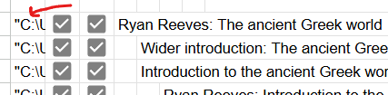

If you double click the cell in the Google Sheet, you'll be able to see the full path.

What you need to do is:

- Make a new folder in the `bibledocs-recordings` folder matching the path of the combined page, if it doesn't already exist. Make any intermediate folders too, if necessary (i.e., they did not already exist).
- Then make a subfolder called `raw` within it

##### Step 2: Move the video recording segments to the raw folder for the wider page study

The raw video recording segments will be located in the `Zoom` folder within the `Family Room` folder on the Dropbox web interface, within a subfolder corresponding to the date and time that we had the Zoom meeting.

You should move the raw video recording segments to the raw folder discussed in Step 1.

{}

Screenshots of Dropbox web interface for moving files

{}

##### Step 3: Rename the video segments according to the format specified in the Content Freelancer Google Sheet

Review the tab on the Content Freelancer Google Sheet titled "Recording segment naming". This tab specifies the video recording segment naming format.

Having moved the video recording segments to the right place in Step 2, you should now rename them according to this format.

As part of this, you should delete and group discussion video recording segments that end up not actually containing anything (i.e., if the video recording segment is just me asking if anyone has anything to discuss and then silence after that). This sometimes happens, if folks don't have anything they want to talk about more.

When you delete these sort of empty group discussion video recording segments, you should also delete the whole corresponding group discussion section on the `combined-page`.

{}

Screenshots of pencil icon to edit file names

{}

{}

Screenshots of double clicking file name to watch the video recording segment

{}

{}

Screenshots of sorting on name, so that video recording segments before they are renamed end up in the right order

{}

#### How to add rows to the Meeting Google Sheets

After I message you telling you that I have pushed the content live, then you'll have everything you need to add rows to the Meeting Google Sheets.

The rows that show up on these sheets will only be `content-pages` (so no `roll-up-pages`). This is *different* than the Content Freelancing Google Sheet (i.e., the one with the checkboxes that let you directly open the files, along with all the TODO tracking). That Google Sheet shows both `roll-up-pages` and `content-pages` (since you also have some TODOs for `roll-up-pages`), but the Meeting Google Sheets *only* show `content-pages` = those that we recorded video segments for.

You should add rows to the meeting sheet in the order we recorded the sections. For each row, fill in:

**1) The date, in the Date column**

This is straightforward. It is just the date we went over the thing in the Bible study

**2) A bibledocs.org link to the combined page webpage, in the Study column**

This is also straightforward. This will be a link to the latest page on the [BibleDocs Ichthys Bible Study](https://www.bibledocs.org/meta/bibledocs-weekly-bible-studies/bibledocs-ichthys-bible-study/) or [BibleDocs Open Bible Study](https://www.bibledocs.org/meta/bibledocs-weekly-bible-studies/bibledocs-open-bible-study/) list pages.

The value in this column will be the same across all sections belonging to the same overall study

**3) A link to a section on the combined page webpage, in the Page column**

You can get this by using the sidebar table of contents on the webpage to select a specific section, like so:

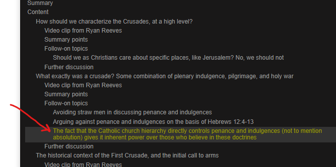

And then copy the URL from the address bar, like so:

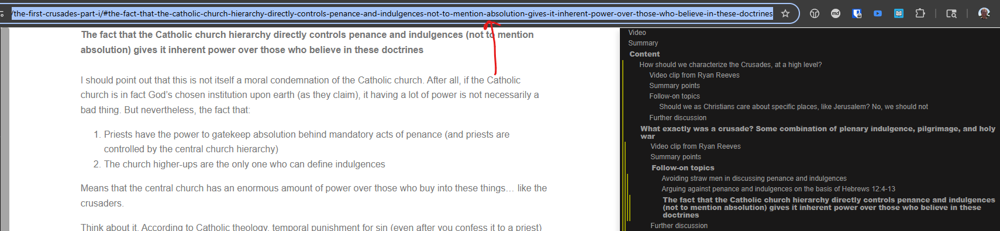

**4) Link(s) to the video segments on Dropbox**

Every row on the meeting sheet represents a different content page. Some of these can have more than one recording segment. In column D on the row, enter all the names of recording segments that belong to the content page in order, pressing `Alt + Enter` between each, so that each ends up on a new line. You should drop the number prefixes and file extensions when creating the links. So, for example, `1-3-summary-points.mp4` becomes just `summary-points`.

After entering all of them, you should highlight the link text for each (i.e., one-by-one, each on a separate line becoming a separate link), and then press `Ctrl + K` to open the menu for adding a link. Once you get to this point, you will need to get the URL to paste into this `Ctrl + K` menu. That is what we will describe next.

For each video segment in the recordings folder associated with the combined page (recall that you moved recording segments into this folder and renamed them in an earlier step), you can get the proper URL to use as the video segment link target by right clicking the video recording segment in the Dropbox web interface, and then selecting "Share > Share with Dropbox", like so:

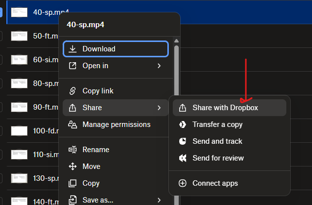

Then click the settings gear:

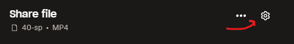

Then click on the "Link for viewing" tab

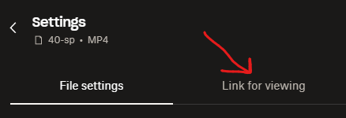

Then click on the "Create link" button:

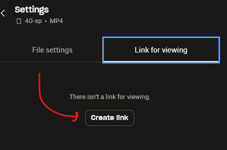

After creating the link for viewing, copy it, and then use it as the link target for the appropriate video segment link on the Meeting Google Sheet's `Ctrl + K` menu. Then repeat for all other segments.

There is one sort of video segment link that is *not* a Dropbox link, and that is the `source-clip` link for `source-clip-video-page` pages that embed YouTube video clips. (Note that currently `source-clip-video-page` pages that embed Ichthys MP3 audio are still Dropbox links, since I record a screen-sharing slides background segment for them. So it is only the embedded YouTube source clips that operate this way). This specific sort of link should link to the wider webpage section above the `Source clip from {source}` header. Note that this will in practice be the exact same link as in the `Sub-part` column. Making the link operate in this way will let folks view the embedded YouTube source clips on the webpage, but basically jump directly there from the Meeting Google Sheet, which is useful.

#### How to add review questions

You will specify review questions within `quizdown` shortcodes:

```markdown=



```

There is a specific format the questions have to show up in. I'll go over each of the types below.

In terms of what you make review questions, you should aim to figure out what the most important topics/takeaways from the page are, and then make review questions for all of those. The number of review questions can vary as necessary, but there is no need to be hesitant of making too many, so long as all of them are related to important concepts/topics.

In terms of which "types" of questions you prioritize (as gone over below), use true/false questions, multiple select questions, and sequence/order questions whenever it is logical (should be pretty obvious), and then prioritize fill-in-the-blank questions over multiple choice in the cases where there will not be an ambiguity about what could go in the blank.

So, for example, if the "blank" is a name of a specific person, generally that works fine as a fill-in-the-blank question. But what if the thing you are asking for is a little less clear? Like, would the user tend to "just know" what the options are?

##### True or false questions

Example:

```markdown
# True or False: The burning bush was a Christophany

In Exodus 3.

1. [x] True
1. [ ] False
```

The choice that is the correct one has an x in it.

You don't have to have any subtext under the question header. So this would work equally fine as a question:

```markdown
# True or False: The burning bush was a Christophany

1. [x] True
1. [ ] False
```

##### Multiple choice questions

```markdown
# Which prophet ran away from Jezebel?

In 1 Kings 19.

1. [ ] Moses
1. [x] Elijah
1. [ ] Elisha
1. [ ] Jeremiah
1. [ ] Isaiah
```

The choice that is the correct one has an x in it.

You don't have to have any subtext under the question header. So this would work equally fine as a question:

```markdown

# Which prophet ran away from Jezebel?
1. [ ] Moses
1. [x] Elijah
1. [ ] Elisha
1. [ ] Jeremiah
1. [ ] Isaiah
```

There are some specific sub-types of questions here that can be useful to consider:

- Which of the following are true questions
- All of the following are true except questions

For example:

```markdown
# Which of the following statements about Jesus are true?

I. Jesus is fully God
II. Jesus is fully man
III. Jesus is co-eternal with the Father

1. [ ] I. alone
1. [ ] II. alone
1. [ ] I. and II.
1. [ ] II. and III.
1. [x] All of the above
```

```markdown
# All of the following statements about Jesus are true except

1. [ ] Jesus possesses a divine nature
1. [ ] Jesus possesses a human nature
1. [ ] Jesus is co-eternal with the Father
1. [x] Jesus possesses an angel nature
1. [ ] Jesus is of one substance with the Father
```

##### Multiple select questions

In questions of this type, more than one choice needs to be selected for the question to be marked as correct.

Example:

```markdown
# Who are the two witnesses of Revelation?

Whose ministries run alongside the 144,000.

- [x] Moses
- [x] Elijah
- [ ] Elisha
- [ ] Jeremiah
- [ ] Isaiah
```

The choices that need to be selected for the question to be marked correct have x's in them.

You don't have to have any subtext under the question header. So this would work equally fine as a question:

```markdown
# Who are the two witnesses of Revelation?

- [x] Moses
- [x] Elijah
- [ ] Elisha
- [ ] Jeremiah
- [ ] Isaiah
```

There are some specific sub-types of questions here that can be useful to consider:

- Which of the following are true questions, written in such a way that more than one choice is selected at the same time
- All of the following are true except questions, with more than one thing excepted

##### Sequence/order questions

These questions make the user order the choices. 

```markdown
# God took specific actions on each of the days in the "creation week". Put the creation days in order

As described in Genesis 1.

1. God created light, separating it from the darkness to establish day and night.
2. God created the expanse (sky/heaven), separating the waters above from the waters below.
3. God gathered the waters to reveal dry land, named the land and seas, and created vegetation (plants and trees).
4. God created the sun, moon, and stars to govern the day and night and to mark seasons, days, and years.
5. God created sea creatures and birds to fill the waters and the sky.
6. God created land animals and humanity (male and female) in His own image, giving them authority over the earth.
7. God rested from all His work.
```

The correct sequence is the one used to define the question. The answers are always shuffled when presented to the user.

You don't have to have any subtext under the question header. So this would work equally fine as a question:

```markdown
# God took specific actions on each of the days in the "creation week". Put the creation days in order

1. God created light, separating it from the darkness to establish day and night.
2. God created the expanse (sky/heaven), separating the waters above from the waters below.
3. God gathered the waters to reveal dry land, named the land and seas, and created vegetation (plants and trees).
4. God created the sun, moon, and stars to govern the day and night and to mark seasons, days, and years.
5. God created sea creatures and birds to fill the waters and the sky.
6. God created land animals and humanity (male and female) in His own image, giving them authority over the earth.
7. God rested from all His work.
```

##### Fill-in-the-blank questions

In these, the user needs to type in the text that answers the question.

```markdown
# Which angel told Mary she was pregnant?

In Luke 1.

1. [x] Gabriel
```

The only thing that distinguishes questions of this type from multiple choice questions is that there is only one choice, which is always checked with an x.

You don't have to have any subtext under the question header. So this would work equally fine as a question:

```markdown
# Which angel told Mary she was pregnant?

1. [x] Gabriel
```

When defining answers to fill-in-the-blank questions, you can make a word or phrase optional by wrapping it in parentheses, followed by a question mark. There should also be a trailing space inside the parentheses (representing the fact that it is optional too: the thing that is optional is the word or phrase plus a trailing space). So, for example, to accept either "Holy Spirit" or "The Holy Spirit" as answers, you'd specify the fill-in-the-blank answer as `(The )?Holy Spirit`.


<!--

#### Content Freelancer: Do initial post-processing of all `content-page` sections that are not `group-discussion-video-page` sections

So that means doing initial post-processing for `original-content-subpart-video-page` sections, `source-clip-video-page` sections, `follow-on-topic-video-page` sections, and so on.

The steps you take to do this depend upon the content type. If it is `discussion` content or original content that is not `outline-content` or `live-content`, then things are simpler:

1. Add a summary to the `content-page` section.
2. Add a `content-comment-call-to-action`, `content-short-title`, and `content-thumbnail-description`

If it is an original content section that is `live-content`, then there is a bit more:

1. Watch the `live-content` video recording segment, and jot down notes as you do so, to help you build a summary. (This is necessary, since the section will either not have any written content at all). Watching it on 1.5x or 2x speed can save time.
2. Use the notes you jotted down while watching the video recording segment to build the summary for the section.
3. Add a `content-comment-call-to-action`, `content-short-title`, and `content-thumbnail-description`.

And if it is an original content section that is `outline-content`, then there is more yet:

1. Replace any Bible passage references with properly-formatted scripture shortcodes.
2. Watch the `outline-content` video recording segment, and jot down notes as you do so, to help you build a summary. (This is necessary, since the section will only have an outline). Watching it on 1.5x or 2x speed can save time.
3. Use the notes you jotted down while watching the video recording segment to build the summary for the section.
4. Add a `content-comment-call-to-action`, `content-short-title`, and `content-thumbnail-description`.

You should take these steps for all `content-page` sections that are not `group-discussion-video-page` sections. (The latter will be handled in the next step, below).

#### Content Freelancer: Do initial post-processing of `group-discussion-video-page` sections

For each `group-discussion-video-page` section, this consists of five things:

4. After giving the `group-discussion-video-page` section a more specific title, use the notes you jotted down while watching the video recording segment to build the summary for the `group-discussion-video-page` section.
5. Add a `content-comment-call-to-action`, `content-short-title`, and `content-thumbnail-description`.

#### Content Freelancer: Message Steven that initial post-processing is done


### Before recording (pre-processing)

1. Steven: scaffold new section(s) in the combined page file (plus a new combined page itself, if it is going to be a new discussion source entirely)
1. Steven: Specify start and stop points for next week's source clip(s) (either the full transcript text if it is available = [Ichthys](https://ichthys.com/) is the source, or the points around the transitions with the exact words **bolded** = some YouTube video is the source)
1. Steven: Add new row to Content Freelancing Google Sheet if adding a new combined page (including pasting in the fully-specified file path, so that the checkboxes to open the files work properly).
1. Steven: Message content freelancer that content is ready to pre-process
1. Content freelancer: Add rows to Content Freelancing Google Sheet, and set up TODOs. ([See below](#add-rows-to-content-freelancing-google-sheet-and-set-up-todos))
1. Content freelancer: Fill in exact timestamps for start and stop points of source clips
1. Content freelancer: If source clip has full transcript, convert it to proper Markdown format (including `scripture` shortcodes and `ichthys-translation` shortcodes)
1. Content freelancer: Message Steven that content pre-processing is done
1. Steven: If source clip has full transcript, add slide breaks
1. Steven: Write content for summary points and follow-on topics

The deadline for weekly pre-processing to be done is Saturday afternoon at 12:00 PM Eastern Time.

I will make sure you get the content to pre-process no later than mid-day the Sunday before, which will give you ballpark six days to finish the pre-processing. If a week will not have pre-processing, I will make sure to still message you and let you know that.

### During recording

1. Steven: If recording a Group Discussion recording segment, un-mute the 8-channel wireless mic system (and then re-mute it after finishing). This prevents unwanted noise during the recording of wider introductions, overviews, summary points, follow-on topics, etc. (basically, anything that is not group discussion).


1. Steven: Add the current timestamp just before starting a new recording segment (on the end of the `date` frontmatter property), so that things will get ordered properly on list pages, in the long-term.


### After recording (post-processing)

1. Content freelancer: Organize recording segments. ([See below](#organize-recording-segments))
1. Content freelancer: Add properly-formatted scripture shortcodes during post-processing, if `outline-content` or `live-content`
1. Content freelancer: Add slide breaks during post-processing, if `outline-content`
1. Content freelancer: Add/update summaries
1. Content freelancer: Add/update subject tags
1. Content freelancer: Add/update passage tags
1. Content freelancer: Add/update review questions
1. Content freelancer: Message Steven that content post-processing is done
1. Steven: Add `short-title` and `thumbnail-description` properties where appropriate
1. Steven: Run pre-processor Python application, check over git diff, commit, push
1. Steven: Message content freelancer that content is now live on website
1. Content freelancer: Add rows to Meeting Google Sheets. ([See below](#add-rows-to-meeting-google-sheets))
1. Content freelancer: Message Steven that Meeting Google Sheets have been updated
1. Steven: Message group chats letting folks know content for the week is now live

The deadline for all post-processing to be done (including updating the Meeting Google Sheets) is Friday afternoon at 5:00 PM Eastern Time. I want to send out the "content is live" message to Bible study attendees no later than early evening on Fridays, so that anybody who wants or needs to watch last week's content has enough time to do so before the Saturday meetings. (Note that the post-processing for the last week is actually due *before* the pre-processing for the next week. So in terms of how you prioritize what you work on first, keep that in mind).

I will make sure you get the content to post-process no later than mid-day the Sunday before, which will give you ballpark five days to finish the post-processing. If a week will not have post-processing, I will make sure to still message you and let you know that.

1. Content freelancer: [Add properly-formatted scripture shortcodes during post-processing, if `outline-content` or `live-content`](/notes/content-freelancer-instructions-add-properly-formatted-scripture-shortcodes-during-post-processing-if-outline-content-or-live-content)
1. Content freelancer: [Add slide breaks during post-processing, if `outline-content`](/notes/content-freelancer-instructions-add-slide-breaks-during-post-processing-if-outline-content)
1. Content freelancer: [Add/update summaries](content-freelancer-instructions-rolling-up-summaries-tags-and-review-questions)
1. Content freelancer: [Add/update subject tags](content-freelancer-instructions-rolling-up-summaries-tags-and-review-questions)
1. Content freelancer: [Add/update passage tags](content-freelancer-instructions-rolling-up-summaries-tags-and-review-questions)
1. Content freelancer: [Add/update review questions](content-freelancer-instructions-rolling-up-summaries-tags-and-review-questions)


## Changelog

### 2026-09-04

The process was modified in several primary overarching ways:

1. Weekly deadlines were established for me (mid-day Sunday) and you = the content freelancer (Friday afternoon; mid-day Saturday), to ensure that we consistently complete all pre-processing and post-processing every week, so nothing piles up and requires future adjustments.
2. The way content is organized was updated substantially, to split out every recording segment (be that a summary points section, follow-on topic section, or group discussion section) into its own video, with corresponding split-out summaries, subject tags, passage tags, review questions, etc. This much-more-split-out structure will require a lot of additional work on our part, but will lead to content that is *much* shorter overall, and therefore much easier to consume. Think videos that are under 30 minutes (and sometimes even under 15 minutes), rather than videos that are multiple hours long.
3. For the time being, after you finish catching up on review questions for the remaining BibleDocs Ichthys Bible Study weeks like we've discussed, I am going to have you only focus on keeping up with new content week-by-week. It will take me some time to get the content backlog updated to be in the new split-out format, at which point we will have to revisit all of it to add/update summaries, subject tags, passage tags, review questions, etc. to everything that has been split out. That will be quite an effort, but we will worry about that later. First, let's just focus on getting all our new content following the desired long-term structure.

Here is a more full list of changes:

- What studies had previously been labeled `live-content` have now been renamed to be `outline-content`. I did this because these studies ended up not being truly live, but well, based off of outlines. The `live-content` content type will probably be used eventually if and when I do true Live Q&As, but what we have been doing recently just isn't that. Not really.
- Content file structure has changed substantially. See [Content freelancer instructions: Content file structure](content-freelancer-instructions-content-file-structure).
  - The new more-split-out content file structure will mean that another dimension has been added to post-processing: figuring out how to "roll up" summaries, tags, and review questions, if necessary. Since every piece of content in the new structure has its own summary, subject tags, passage tags, and review questions, it will be necessary to figure out what things are shared, and what things should stay separated. Since this is a bit confusing, I wrote up a page explaining it in detail: [Content freelancer instructions: Rolling up summaries, tags, and review questions](content-freelancer-instructions-rolling-up-summaries-tags-and-review-questions).
- The structure of the Content Freelancing Google Sheet has changed substantially, to account for the more-split-out structure. See [Content freelancer instructions: Content Freelancing Google Sheet](content-freelancer-instructions-content-freelancing-google-sheet). Different types of sections require different things in terms of pre-processing and post-processing (some of these being completely new relative to what we were doing before), but what needs to be done will always be made clear in the Content Freelancing Google Sheet, so you will never have to guess.
  - Independent from the structure changes in the Content Freelancing Google Sheet related to having more-split-out sections, I also removed the columns to track how many hours you spent on specific tasks, and decided to switch to a fixed amount per type of section, paid monthly. That way you won't have to waste time trying to keep up with exactly what amount of time you spent on what. I trust you unconditionally (unlike freelancers whom I do not know in my personal life), so we can get away with less bookkeeping in this way, which will save you time and admin overhead overall. We can talk about what rate is fair for each type of segment as part of me going over all this with you.
  - I also changed the title of the checkbox column to open files in VSCode to just "C", standing for "Content freelancer" (rather than your initial, as previously).
- The structure of the Bible Study Google Sheets have changed substantially, to account for the more-split-out structure. See [Meeting Google Sheets](meeting-google-sheets).
- I will now pause for group discussion during the Bible studies after every summary point section and every individual follow-on topic, rather than only having one single group discussion time after going through everything in a section. This will keep group discussion segments more separated and focused, leading to shorter group discussion videos overall.
- I will now add parameters called `short-title` and `thumbnail-description` to every recording segment that will become a video of its own, to keep up week-by-week with content design decisions. (These parameters will eventually be used when the YouTube videos and podcast episodes are actually made).
- Rather than having a link on the public webpages to a Dropbox folder containing recording segments, recording segments will now be added as links on the group-specific Meeting Google Sheets. This will help me avoid running into bandwidth problems in sharing via Dropbox. Once stuff goes up on YouTube this will change again, but for now, I've decided this is best.


------------------


### Add rows to Content Freelancing Google Sheet, and set up TODOs

Under the new row I added for whichever specific Bible study (which represents a combined page) on the Content Freelancing Google Sheet, you will need to add additional rows for each header on the combined page representing a separate page (both roll-up pages for sections, and content pages). These are all documented on this page: [Content freelancer instructions: Content file structure](content-freelancer-instructions-content-file-structure).

- When you add the sub-pages, you should indent one column for each additional level of section nesting. Look at past weeks for examples of what this means.
- Note that group discussion sections will be nested under `source-clip` or `follow-on-topic` sections, and so on. Group discussion sections will thus usually be pretty deeply nested.
- After adding the title on the new row, fill in the correct page layout in Column I. Look at examples from past weeks for guidance. You *must* fill this in for each row.
- For all the rows you add, also copy down the path value saved in Column A. Since we are keeping everything on combined pages for the moment, you can just copy this value down for all new rows you add, and won't have to worry about where it comes from. You will need to do this to make the checkboxes that open the Markdown files work properly.

After you add new rows to the sheet for each segment we did during the given week's meeting (and specify the appropriate page layout for each), the next step is to copy down a formula to pre-populate the TODOs for you (which vary by page layout).

Start out with Cell K2 selected, like so:

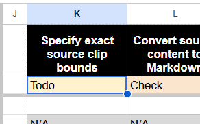

Then press `Ctrl + Shift + RightArrow`, to extend your selection to the end of the formula block on Row 2.

Then press `Ctrl + C` to copy

Then put your cursor on the first blank row in Column K, representing the first section you just added that does not yet have TODOs. Like so:

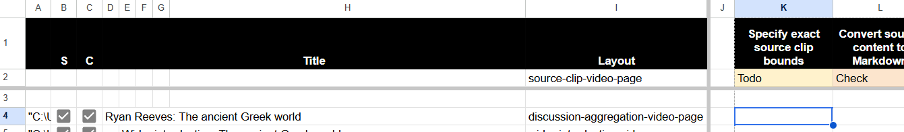

Then press `Shift + DownArrow` repeatedly, until you have all the cells in Column K selected that correspond to the new section rows. Like so:

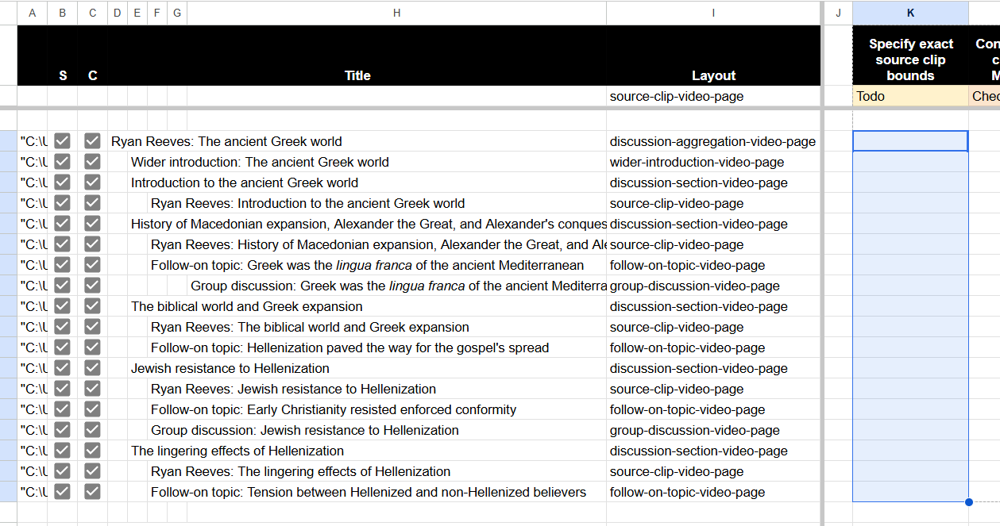

Then press `Ctrl + V` to paste the formulas you copied

Then press `Ctrl + C` to copy the full block you just pasted

Then press `Ctrl + Shift + V` to paste again, but this time pasting values instead of formulas.

Now you will have the appropriate TODOs for all the rows pre-populated, and can start working through them


--------------------------------------------


2) delete the corresponding row in the Content Freelancing Google Sheet (that was added by you before, when you were setting up TODOs for all the segments). You can delete a row in Google Sheets by right clicking on the row number, and then clicking "Delete row", like so:

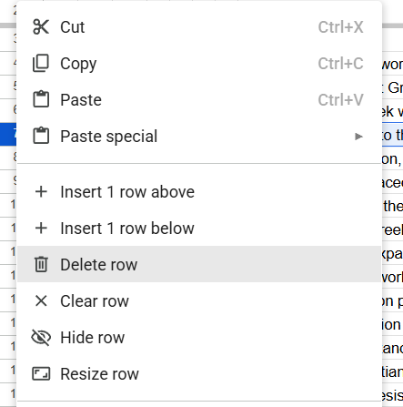


### Things that precede tracking work in the Content Freelancing Google Sheet

- Organize recording segments = move them into correct Dropbox folder (make it if it doesn't already exist) and rename them to the correct format. Delete any group discussion segments that didn't happen.
- Add rows to Content Freelancing Google Sheet, and set up TODOs

### Things that happen after I publish content for the week live, but before I send the update to the chats

- Add rows to Meeting Google Sheets (including links to video segments, and links to live pages/sections)


How things will change after split script is written:

- Before the pre-process/check/commit/push step, run the split script
- Add Update freelancing Google Sheet step at the end, to make the individual page links correct

How things will change when videos are actually going to be generated:

- After running the split script, generate the videos, and check them over. Then push them live

-->

{}

{}
